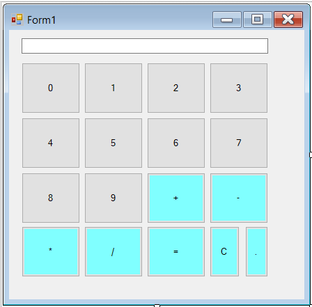

# Kalkulator Sederhana dengan VB.NET

  

Sebuah aplikasi kalkulator dasar yang dibangun menggunakan Visual Basic .NET (VB.NET) dengan antarmuka yang intuitif dan fungsionalitas operasi aritmetika standar.

## 📜 Kutipan

> *"Aku tidak berilmu; yang berilmu hanyalah DIA. Jika tampak ilmu dariku, itu hanyalah pantulan dari Cahaya-Nya."*

## Picture


## 🚀 Fitur Utama

- **Operasi Dasar**:
  - Penjumlahan (+)
  - Pengurangan (-)
  - Perkalian (×)
  - Pembagian (÷)
  
- **Fungsi Tambahan**:
  - Tombol Clear (C) untuk mereset perhitungan
  - Validasi input untuk mencegah pembagian dengan nol
  - Pembatasan input hanya menerima angka dan satu titik desimal
  - Tampilan yang responsif dan user-friendly

- **Kontrol Input**:
  - Input angka 0-9 melalui tombol
  - Dukungan untuk bilangan desimal
  - Logika perhitungan yang akurat

## 🛠️ Panduan Instalasi

### Persyaratan Sistem
- Visual Studio 2019/2022 (Disarankan versi terbaru)
- .NET Framework 4.7.2 atau lebih tinggi

### Langkah-langkah Menjalankan Aplikasi
1. **Clone Repository**:
   ```bash
   git clone https://github.com/Alghifari888/Kalkulator.git
   ```

2. **Buka Project**:
   - Buka file solusi `Kalkulator.sln` di Visual Studio

3. **Jalankan Aplikasi**:
   - Tekan `F5` atau tombol **Start** untuk memulai aplikasi

## 📋 Struktur Komponen

| Tipe Komponen | Nama Komponen | Deskripsi Fungsi |
|--------------|--------------|-----------------|
| TextBox      | `txtDisplay` | Area tampilan untuk input dan hasil perhitungan |
| Button       | `btn0` - `btn9` | Tombol input angka 0 hingga 9 |
| Button       | `btnAdd`     | Tombol operasi penjumlahan (+) |
| Button       | `btnSubtract` | Tombol operasi pengurangan (-) |
| Button       | `btnMultiply` | Tombol operasi perkalian (×) |
| Button       | `btnDivide`   | Tombol operasi pembagian (÷) |
| Button       | `btnEquals`   | Tombol untuk mengeksekusi perhitungan (=) |
| Button       | `btnClear`    | Tombol untuk mereset kalkulator (C) |

## 🤝 Berkontribusi

Kami menyambut kontribusi dari developer lain! Jika Anda ingin:
- Melaporkan bug
- Menambahkan fitur baru
- Meningkatkan kode yang ada

Silakan:
1. Fork repository ini
2. Buat branch fitur Anda (`git checkout -b fitur/namafitur`)
3. Commit perubahan Anda (`git commit -m 'Menambahkan fitur baru'`)
4. Push ke branch (`git push origin fitur/namafitur`)
5. Buat Pull Request

## ✨ Penghargaan

Dikembangkan dengan ❤ oleh [Alghifari](https://github.com/Alghifari888) sebagai proyek edukasi open-source.

---

**Catatan**: Proyek ini cocok untuk pemula yang ingin mempelajari dasar-dasar pemrograman VB.NET dan konsep pembuatan aplikasi desktop sederhana.
